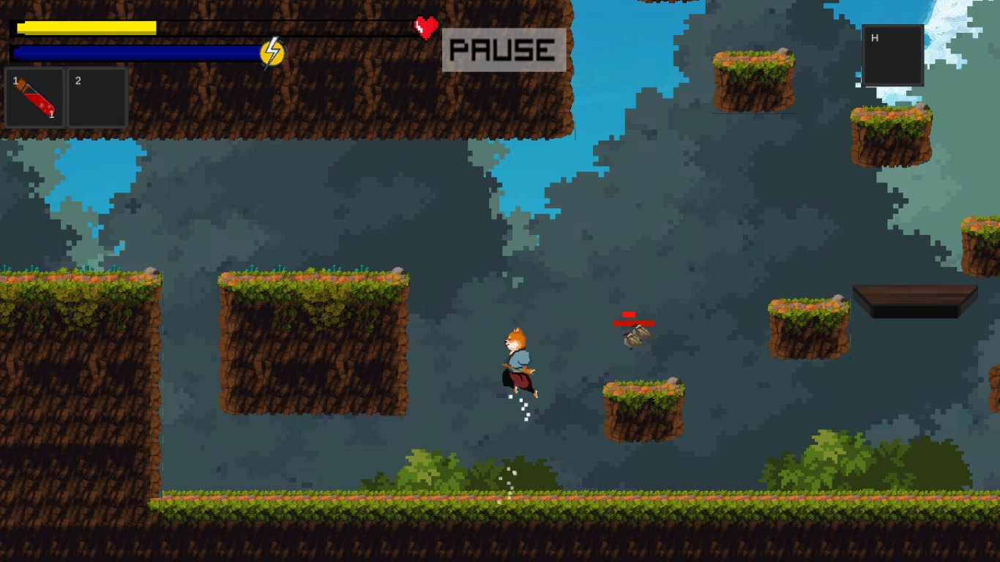

# SamuraiShiba
Samurai Shiba is a 2D platform game. The world has been corrupted by darkness. Shiba has lost his memory. As soon as he wakes up, the Golden Shadows tells him the way. Our hero will travel across multiple dungeons with a lot of strange creatures and evil powers. At the end of each zone, Shiba must defeat the boss of stage to free his friends from the darkness and regain his abilities.

Samurai Shiba is a game developed for the Video game Design and Programming course at the Politecnico di Milano. More information at:

http://www.polimigamecollective.org

https://polimi-game-collective.itch.io/

